# WEB-FIST 

### 개발 이유 및 설명
> 2020년 3월부터 진행한 연구인 "스마트폰을 활용한 수고 및 흉고직경 측정 애플리케이션 개발"로
> 개발한 Android Application (으)로부터 산출되는 데이터의 관리가 필요했고, 
> 산림업계 사용자들이 보다 쉽게 관리할 수 있도록 하기 위해 진행되었습니다.
>
> 이 프로젝트는 Android Application 을 통해 측정한 값을 Web 상에서 관리 및 조회할 수 있는 기능을 제공하고 있습니다.  
> Kakao Map API를 활용한 위치 조회 기능을 개발하였습니다.   
> 

### 개발 환경 및 활용 라이브러리, API
* 개발 환경
    * IntelliJ 2020.02
    * Java 13
    * SpringBoot 2.3.3
    * Gradle 6.6.1
    * MySQL 8.0.17
* 라이브러리
    * JPA
    * Thymeleaf
    * Lombok
    * LiveReload
    * J Query 3.5.1
    * POI 4.1.2
* API
    * Kakao Map API

### 팀 소개 (4인)
* 총 연구 기획 및 책임자 - Ja-Mong 
* 모바일 앱 및 웹 개발 - eunnjji, Mollis-Kim
* 연구 지원 - Baemumuchim(BulgogiJOA, 동일인물)

### 화면 구성 및 기능 설명

* 화면 구성도
     
     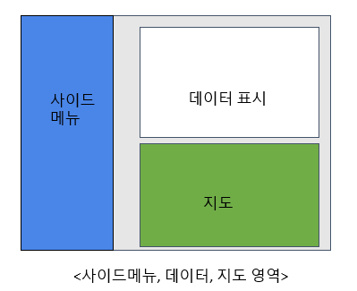
* 메인화면

     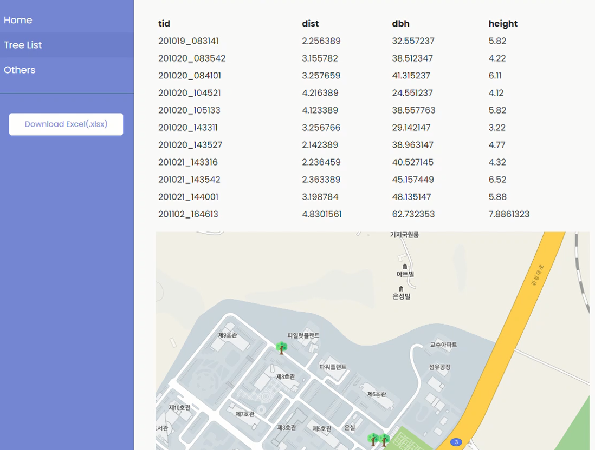
* 메뉴 구성     

     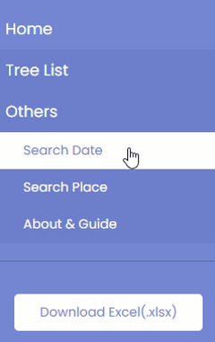
* 날짜 기반 조회

    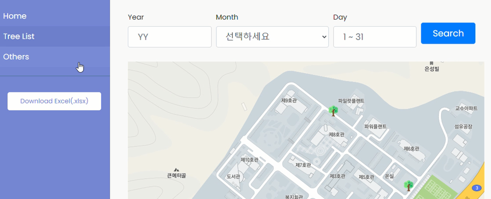
     
    > 연도와 일자는 2자리 형식에 맞춰 입력하고, 월은 선택해서 검색이 가능함
     연도, 월, 일 각각 따로 지정하여 검색이 가능하며 
     셋 모두 지정하지 않고 조회 버튼을 눌렀을 경우 전체 조회를 수행함
    - 날짜 지정
    
    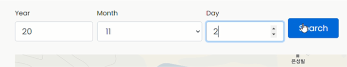
    - 결과
    
    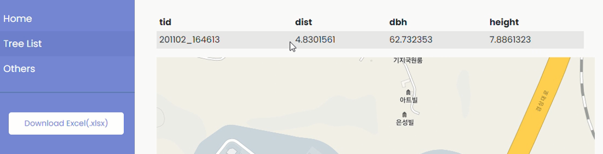
    
* 위치 기반 조회

    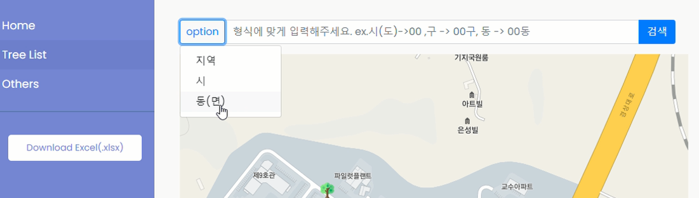
    
    >옵션의 지역, 시, 동(면)을 선택하고 형식에 맞춰 조회할 장소를 입력하여 검색 버튼을 누르면
    해당하는 지역에서 측정된 수목을 조회할 수 있음
    - 장소 지정 및 결과
    
    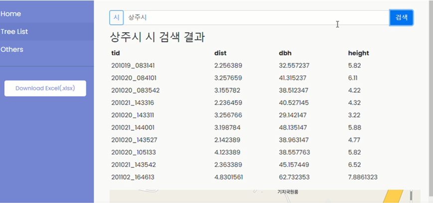

* 엑셀 다운로드

     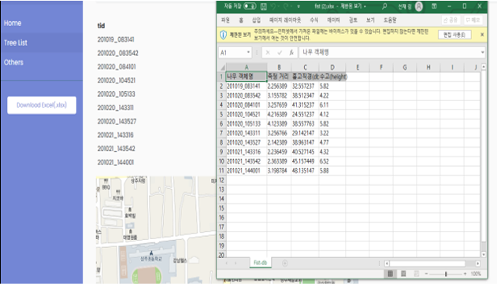
     
     >사이드 메뉴의 다운로드 버튼을 누르면 즉시 엑셀 파일로 DB에 저장된 모든 수목 정보가 엑셀파일로 다운됩니다.
* 수목 정보 상세 페이지
    - 기본
    
    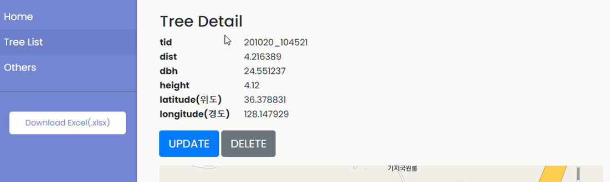
    - 수정
    
    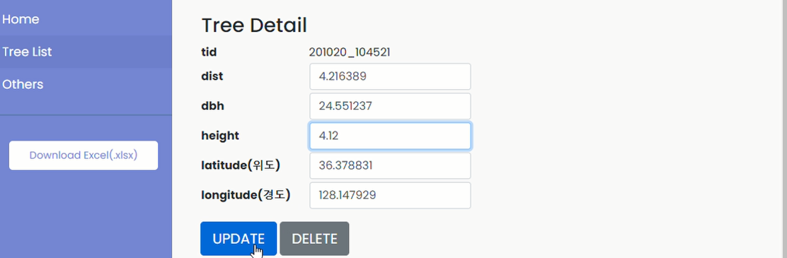
    - 삭제
    
    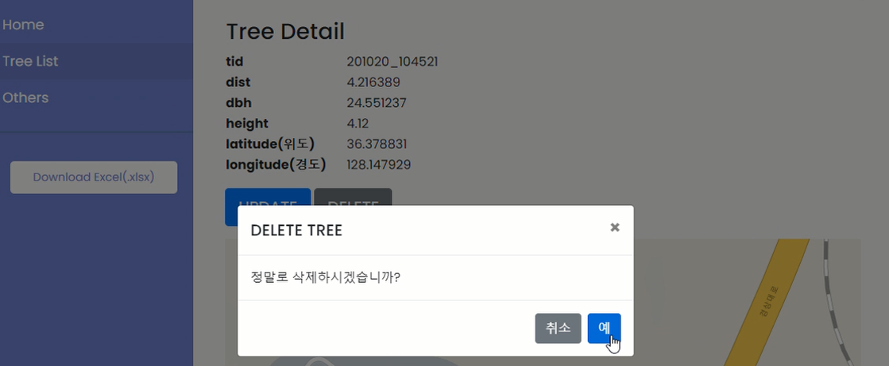
